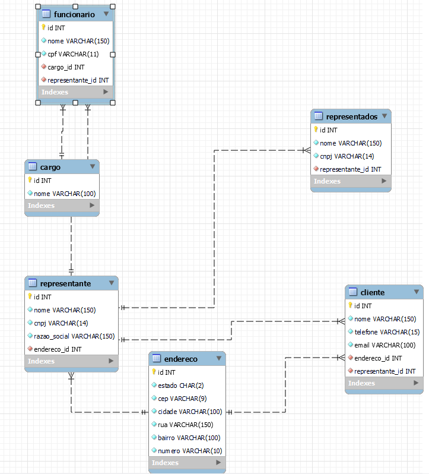

# Detalhamento de Requisitos Peleja Representações

## Índice
- [Entidades](#entidades)
  - [1. Representante](#1-representante)
  - [2. Endereço](#2-endereço)
  - [3. Representados](#3-representados)
  - [4. Funcionário](#4-funcionário)
  - [5. Cargo](#5-cargo)
  - [6. Cliente](#6-cliente)
- [Funcionalidades](#funcionalidades)
- [Modelo Entidade-Relacionamento (MER)](#modelo-entidade-relacionamento-mer)
  - [Entidades e Relacionamentos](#entidades-e-relacionamentos)
  - [Diagrama Conceitual](#diagrama-conceitual)
-[Diagrama UML](#diagrama-uml-🧾)
- [API Endpoints](#api-endpoints)
  - [1. Representante](#1-representante-🏣)
  - [2. Funcionário](#2-funcionário-🙍🏼)
  - [3. Cliente](#3-cliente-👩🏼‍🦰)
  - [4. Cargo](#4-cargo-🌟)
  - [5. Endereço](#5-endereço-✉️)

## Entidades

### 1. Representante
- **Atributos**: `id`, `nome`, `cnpj`, `razao_social`, `endereco_id`
- **Regras de Negócio**:
  - Um representante deve ter um CNPJ válido e único.
  - O endereço deve ser informado.
  - Deve ser possível listar os funcionários, representados e clientes vinculados a cada representante.

### 2. Endereço
- **Atributos**: `id`, `estado`, `cep`, `cidade`, `rua`, `bairro`, `numero`
- **Regras de Negócio**:
  - O CEP deve ser validado no formato correto.
  - O estado deve ser um código de dois caracteres (ex.: "SP").
  - Um endereço pode ser vinculado a um representante ou cliente.

### 3. Representados
- **Atributos**: `id`, `nome`, `cnpj`
- **Regras de Negócio**:
  - O CNPJ deve ser válido e único.
  - Deve estar vinculado a um ou mais representantes.

### 4. Funcionário
- **Atributos**: `id`, `nome`, `cpf`, `cargo_id`
- **Regras de Negócio**:
  - O CPF deve ser válido e único.
  - Um funcionário deve estar vinculado a um cargo e a um representante.

### 5. Cargo
- **Atributos**: `id`, `nome`
- **Regras de Negócio**:
  - Um cargo pode ser associado a múltiplos funcionários.

### 6. Cliente
- **Atributos**: `id`, `nome`, `telefone`, `email`, `endereco_id`
- **Regras de Negócio**:
  - O email deve ser válido e único.
  - O telefone deve seguir um padrão de formatação.
  - Deve estar vinculado a um representante e ter um endereço associado.

## Funcionalidades
- Cadastro, listagem, atualização e exclusão de representantes, funcionários, cargos, representados, clientes e endereços.
- Validação de CNPJ e CPF ao cadastrar ou atualizar representantes, representados e funcionários.
- Associar múltiplos funcionários, representados e clientes a um representante.
- Consultar a lista de clientes e representados vinculados a um representante.

# Modelo Entidade-Relacionamento (MER)

## Entidades e Relacionamentos

### Representante
- Relacionamento:
  - "1:N" com **Funcionário** (um representante pode ter vários funcionários).
  - "1:N" com **Representados** (um representante pode representar vários representados).
  - "1:N" com **Cliente** (um representante pode ter vários clientes).
  - "1:1" com **Endereço** (um representante possui um endereço).

### Funcionário
- Relacionamento:
  - "N:1" com **Cargo** (um cargo pode ser atribuído a vários funcionários).

### Cliente
- Relacionamento:
  - "1:1" com **Endereço** (um cliente possui um endereço).

## Diagrama Conceitual

```plaintext
[Representante] 1—n [Funcionário]
[Representante] 1—n [Representados]
[Representante] 1—n [Cliente]
[Representante] 1—1 [Endereço]
[Funcionário] n—1 [Cargo]
[Cliente] 1—1 [Endereço]
```
# Diagrama UML 🧾


# API Endpoints

## 1. Representante 🏣
- **GET /representantes**: Retorna uma lista de todos os representantes.
- **GET /representantes/{id}**: Retorna um representante específico com base no `id`.
- **POST /representantes**: Cria um novo representante.
- **PUT /representantes/{id}**: Atualiza um representante existente.
- **DELETE /representantes/{id}**: Deleta um representante existente.

## 2. Funcionário 🙍🏼
- **GET /funcionarios**: Retorna uma lista de todos os funcionários.
- **GET /funcionarios/{id}**: Retorna um funcionário específico com base no `id`.
- **POST /funcionarios**: Cria um novo funcionário.
- **PUT /funcionarios/{id}**: Atualiza um funcionário existente.
- **DELETE /funcionarios/{id}**: Deleta um funcionário existente.

## 3. Cliente 👩🏼‍🦰
- **GET /clientes**: Retorna uma lista de todos os clientes.
- **GET /clientes/{id}**: Retorna um cliente específico com base no `id`.
- **POST /clientes**: Cria um novo cliente.
- **PUT /clientes/{id}**: Atualiza um cliente existente.
- **DELETE /clientes/{id}**: Deleta um cliente existente.

## 4. Cargo 🌟
- **GET /cargos**: Retorna uma lista de todos os cargos.
- **GET /cargos/{id}**: Retorna um cargo específico com base no `id`.
- **POST /cargos**: Cria um novo cargo.
- **PUT /cargos/{id}**: Atualiza um cargo existente.
- **DELETE /cargos/{id}**: Deleta um cargo existente.

## 5. Endereço ✉️
- **GET /enderecos**: Retorna uma lista de todos os endereços.
- **GET /enderecos/{id}**: Retorna um endereço específico com base no `id`.
- **POST /enderecos**: Cria um novo endereço.
- **PUT /enderecos/{id}**: Atualiza um endereço existente.
- **DELETE /enderecos/{id}**: Deleta um endereço existente.


